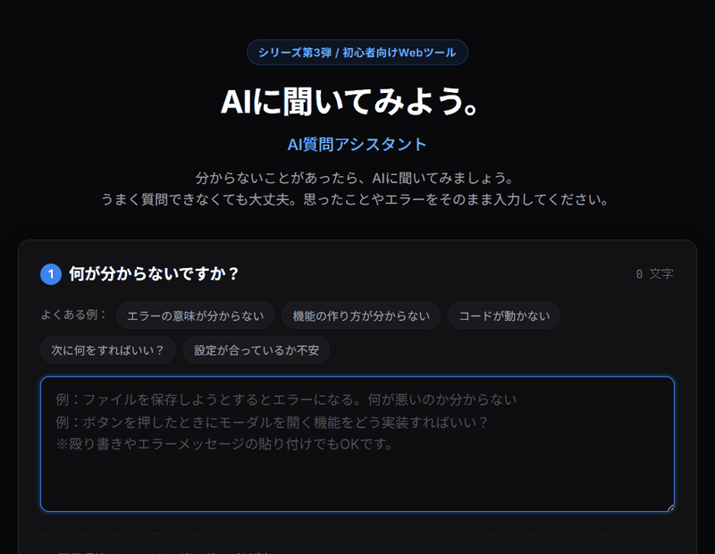

# AIに聞いてみよう。

## AI質問アシスタント

> 分からない？
>
> だったら、AIに聞いてみよう。

AI開発をしていると、

- 何をすればいいか分からない
- エラーの意味が分からない
- AIにどう質問すればいいか分からない
- 調べ方が分からない
- 次に何をすればいいか分からない

ということがあります。

そんなときに、AIへ質問するための内容を整理する小さなWebツールです。



---

## コンセプト

# AIに聞いてみよう。

AI開発では、分からないことが出てくるのは普通です。

分からないから止まるのではなく、

> **分からなければAIに聞く。**

それだけでいい。

このツールは、AIに質問するための文章を考えること自体が面倒なときに使います。

---

## 使い方

### 1. 分からないことを入力

例えば、

> 「Antigravityでこのエラーが出たけど意味が分からない」

> 「この機能をどう作ればいいか分からない」

> 「AIに作ってもらったけど、次に何をすればいいか分からない」

など、思ったことをそのまま入力します。

きれいな文章にする必要はありません。

---

### 2. AIに聞くための質問を作る

入力した内容をもとに、

**AIにそのまま渡せる質問文**

を作ります。

必要に応じて、

- 状況
- やりたいこと
- 現在困っていること
- エラーメッセージ
- 確認したいこと

などを整理します。

---

### 3. AIに質問する

生成された質問文をコピーして、普段使っているAIへ送ります。

使用するAIは問いません。

ChatGPT、Gemini、Claude、その他のAIなど、自分が使っているAIを利用できます。

---

## 例えば

入力：

> 「ファイルを保存しようとするとエラーになる。何が悪いのか分からない」

生成される質問の例：

> ファイル保存機能を実装しています。
>
> 現在、ファイルを保存しようとするとエラーが発生します。
>
> このエラーの原因として考えられることを説明し、確認すべき箇所と修正方法を教えてください。
>
> エラーメッセージ：
> ○○○

この質問をAIへ送ります。

---

## このツールが大切にすること

AIに質問するときに、完璧な質問文を書く必要はありません。

まず、

> 「分からない」

と入力すればいい。

あとはAIに質問しやすい形へ整理してもらいます。

---

## このツールがしないこと

このツール自身がAIとして回答するわけではありません。

AI APIを内蔵することもしません。

このツールは、

> **AIに聞くための質問を作る**

ことだけを目的とします。

---

## 対象

- AI開発初心者
- AIを使ってソフトウェアを作っている人
- AIへの質問が苦手な人
- 何を聞けばいいか分からない人
- エラーや問題が発生して困っている人

---

## 公開

GitHub Pagesで利用できる無料Webツールとして公開します。

インストールは必要ありません。

- **Webアプリ公開URL**: [https://tk030-lotto.github.io/ai-ni-kiitemiyou/](https://tk030-lotto.github.io/ai-ni-kiitemiyou/)
- **ホスティング**: GitHub Pages (無料 / インストール不要 / スマホ即時利用対応)
- **ソースコード**: [GitHub Repository](https://github.com/tk030-lotto/ai-ni-kiitemiyou)
- **ライセンス**: [MIT License](LICENSE)

---

## ライセンス (License)

本ソフトウェアは **[MIT License](LICENSE)** の下で公開されています。

```text
MIT License

Copyright (c) 2026 tk030

Permission is hereby granted, free of charge, to any person obtaining a copy
of this software and associated documentation files (the "Software"), to deal
in the Software without restriction, including without limitation the rights
to use, copy, modify, merge, publish, distribute, sublicense, and/or sell
copies of the Software, and to permit persons to whom the Software is
furnished to do so, subject to the following conditions:

The above copyright notice and this permission notice shall be included in all
copies or substantial portions of the Software.

THE SOFTWARE IS PROVIDED "AS IS", WITHOUT WARRANTY OF ANY KIND, EXPRESS OR
IMPLIED, INCLUDING BUT NOT LIMITED TO THE WARRANTIES OF MERCHANTABILITY,
FITNESS FOR A PARTICULAR PURPOSE AND NONINFRINGEMENT. IN NO EVENT SHALL THE
AUTHORS OR COPYRIGHT HOLDERS BE LIABLE FOR ANY CLAIM, DAMAGES OR OTHER
LIABILITY, WHETHER IN AN ACTION OF CONTRACT, TORT OR OTHERWISE, ARISING FROM,
OUT OF OR IN CONNECTION WITH THE SOFTWARE OR THE USE OR OTHER DEALINGS IN THE
SOFTWARE.
```